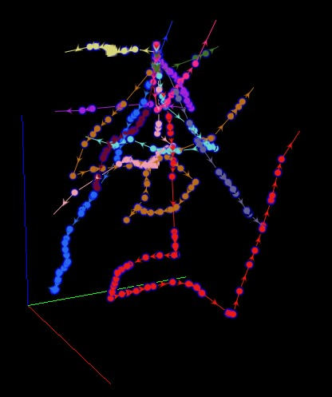
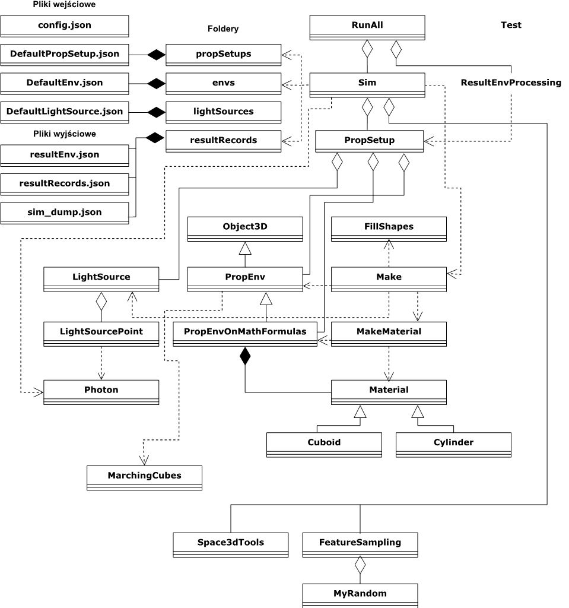
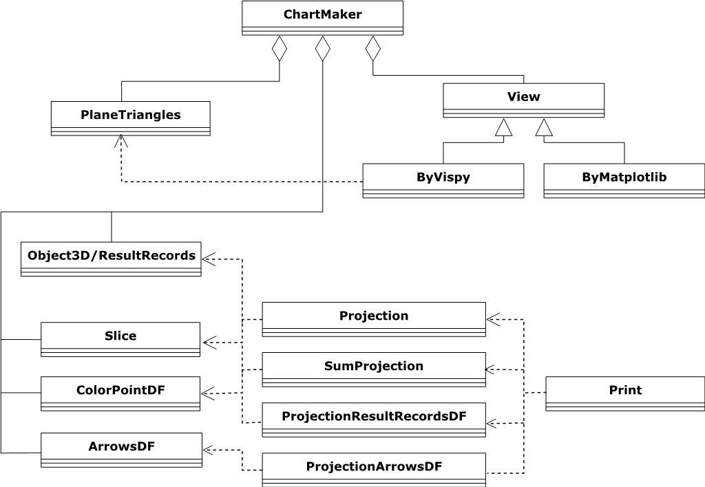
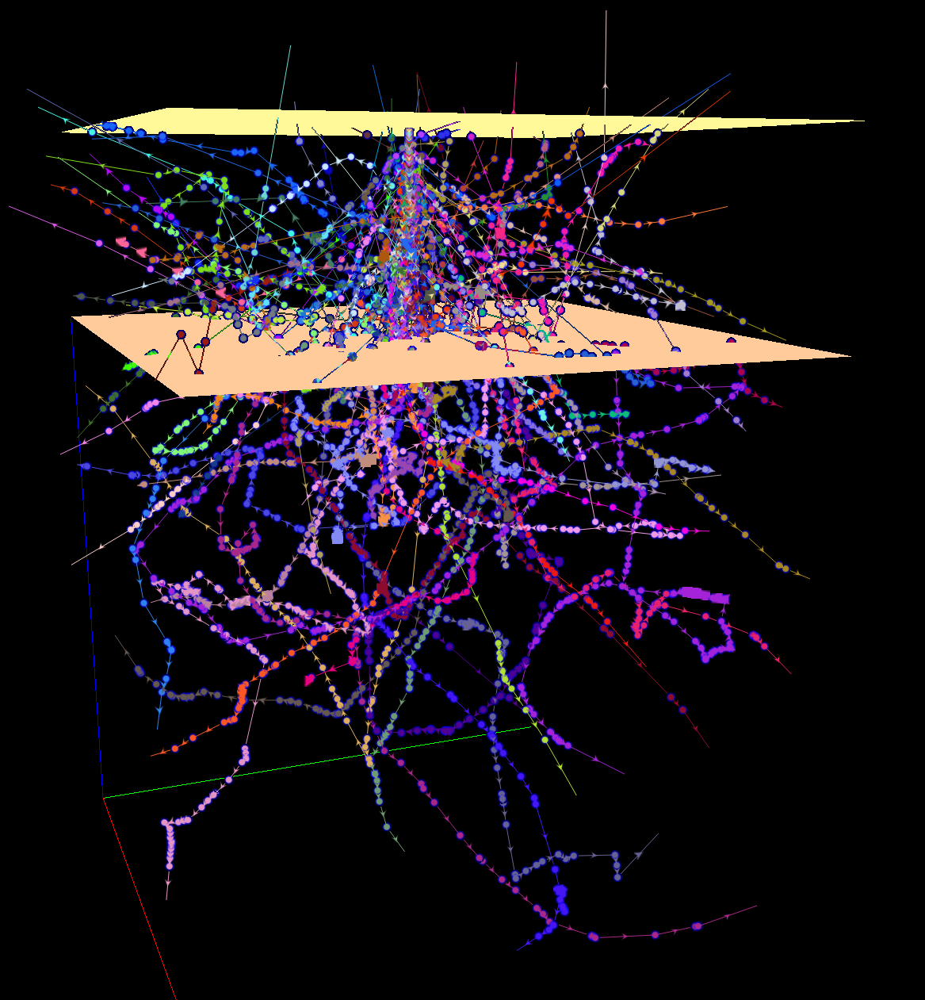
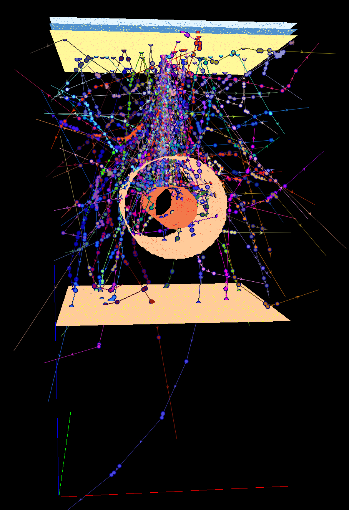

<h1 align="center">monte-carlo-sim-python</h1>
<p align="center">
<i>Light simulation in 3D tissue using Monte Carlo method</i><br/>
my own implementation<br/>
author: Mateusz Miler<br/>
<a href="./README.md">Polish<a/>
<a href="./readme_eng.md">English<a/>
</p><br/>

<p align="center"><br/>
<i>Visualization of the 10-photon motion path on epidermal tissue</i></p><br/>

### Related projects
- [monte-carlo-sim-python](https://github.com/Mateuszq28/monte-carlo-sim-python) - light simulation and 3D photon path visualization module (using Vispy)
- [monte-carlo-sim-benchmark](https://github.com/Mateuszq28/monte-carlo-sim-benchmark) - adapted example simulations from literature (tiny, small, mc321), saving to a uniform "CUBES.json" format, post-processing and normalization, generating comparative tables, graphs, heat maps, 3D visualizations of orthogonal heat maps
- [monte-carlo-sim-tables](https://github.com/Mateuszq28/monte-carlo-sim-tables) - tables with statistics of photon transport distributions for the conducted experiments
- [CUBES](https://1drv.ms/f/c/7871da7edeb06dcc/Ei70d6guE4lBgMsf6FgGbJsBUcYmqrgZFZZxBHvQeMgqBQ) - results of the most important experiments saved in the unified CUBE.json format

### Preparing the environment

```shell
conda install PyOpenGL tabulate opencv matplotlib pillow vispy scipy numpy pandas Geometry3D tqdm
```

If you have some problems with finding packages in Anaconda, try download conda-build from there: \
https://anaconda.org/anaconda/conda-build/files \
and then install (file for python 11):

```shell
conda install win-64/conda-build-3.26.1-py311haa95532_0.tar.bz2
```

*Quick start:* read classes RunAll.py and Sim.py \
and try an example:

```shell
python RunAll.py
```

### Requirements that worked
If you can run this project, after successful instalation, please add a pull request with your environment installed package list dump into requirements_that_worked folder. It will help us to maintain the project and the other users to run.

### Statistics
number of python files: 31</br>
number of classes: 41</br>
lines of code: 9184</br>

```shell
ls | grep \'.py^' |xargs wc -l
81 ArrowsDF.py
67 ByMatplotlib.py
358 ByVispy.py
703 ChartMaker.py
561 ColorPointDF.py
892 FeatureSampling.py
21 FillShapes.py
234 LightSource.py
167 Make.py
93 MakeMaterial.py
342 MarchingCubes.py
413 Material.py
217 Object3D.py
29 Photon.py
61 PlaneTriangles.py
302 Print.py
83 Projection.py
102 ProjectionArrowsDF.py
220 ProjectionResultRecordsDF.py
420 PropEnv.py
141 PropEnvVec.py
209 PropSetup.py
140 ResultEnvProcessing.py
128 RunAll.py
547 Sim.py
308 Slice.py
271 Space3dTools.py
113 SumProjection.py
1787 Test.py
157 test_wrapper.py
17 View.py
9184 total
```

### Gallery

<p align="center"><br/>
<i>Class Diagram</i></p><br/>

<p align="center"><br/>
<i>Generators interface diagram</i></p><br/>

<p align="center"><br/>
<i>Visualization module diagram</i></p><br/>

<p align="center"><br/>
<i>Visualization of the motion path of 100 photons</i></p><br/>

<p align="center"><br/>
<i>A beam of 100 photons directed at tissue with a blood vessel</i></p><br/>
